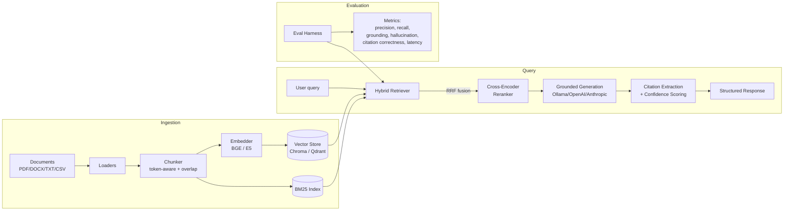

# Enterprise RAG System

A production-style **Retrieval-Augmented Generation** platform for enterprise and internal documents. Built to answer questions over internal PDFs, reports, technical docs, and planning files with **hybrid retrieval**, **cross-encoder reranking**, **grounded citations**, **structured outputs**, and a built-in **evaluation pipeline**.

This is not "chat with PDF." The design priorities are retrieval quality, grounding, hallucination reduction, and an architecture you could actually run as internal company AI infrastructure.

---

## Why this exists

Most RAG demos stop at "embed a PDF, stuff the top-3 chunks into a prompt." That falls apart on real corpora: semantic search misses exact identifiers and codes, single-stage retrieval surfaces near-duplicates, and ungrounded models confidently invent facts.

This system addresses each of those directly:

| Problem | Approach in this repo |
|---|---|
| Semantic search misses exact terms | **Hybrid retrieval**: vector + BM25 keyword, fused with Reciprocal Rank Fusion |
| First-stage retrieval is imprecise | **Cross-encoder reranking** over the top candidates |
| Models hallucinate | **Strict grounding prompt** + citation extraction + confidence scoring |
| "It works on my 3 questions" | **Evaluation harness** measuring precision, recall, grounding, hallucination rate, citation correctness, latency |
| Vendor lock-in | **Adapter patterns** for vector DB (Chroma/Qdrant) and LLM (Ollama/OpenAI/Anthropic) |

---

## Architecture



### Request lifecycle for a query

1. **Retrieve** — embed the query, run vector search (top-20) and BM25 (top-20) in parallel.
2. **Fuse** — combine both result sets with weighted Reciprocal Rank Fusion (robust to differing score scales).
3. **Rerank** — a cross-encoder scores `(query, passage)` jointly over the fused candidates and keeps the top-N.
4. **Generate** — the reranked chunks are formatted into a strict grounding prompt; the LLM must cite chunk ids inline.
5. **Cite + score** — citations are extracted and validated against retrieved chunks; a confidence score is computed from retrieval scores + citation presence.

---

## Project structure

```
enterprise-rag-system/
├── app/
│   ├── core/            # config (pydantic-settings) + structured logging
│   ├── schemas/         # pydantic models — the contract between layers
│   ├── ingestion/       # loaders, chunker, embedder, ingest pipeline
│   ├── retrieval/       # vector store adapters, BM25, hybrid + RRF
│   ├── reranking/       # cross-encoder reranker
│   ├── generation/      # LLM providers, prompts, RAG orchestrator
│   ├── evaluation/      # metrics + eval harness
│   └── api/             # FastAPI app
├── frontend/
│   ├── streamlit/       # demo UI
│   └── react/           # production-style React + TS UI
├── documents/           # drop your source docs here
├── benchmark_results/   # eval reports (json + markdown) land here
├── tests/               # unit tests + eval_cases.yaml
├── scripts/             # ingest.py, query.py, run_eval.py
├── docker/              # Dockerfiles + nginx config
├── docker-compose.yml
├── requirements.txt
└── .env.example
```

---

## Quickstart (local, no Docker)

### 1. Install

```bash
python -m venv .venv && source .venv/bin/activate
pip install -r requirements.txt
cp .env.example .env          # edit as needed
```

### 2. Run an LLM backend

The default provider is **Ollama**. Install it, then:

```bash
ollama pull mistral           # or llama3
ollama serve
```

Prefer cloud? Set `OPENAI_API_KEY` or `ANTHROPIC_API_KEY` in `.env`. The system tries providers in `LLM_FALLBACK_ORDER` and falls back automatically.

### 3. Add documents and ingest

```bash
cp ~/your-docs/*.pdf documents/
python scripts/ingest.py documents/
```

### 4. Ask a question

```bash
python scripts/query.py "What caused the Q3 capacity shortfall?"
python scripts/query.py --type summary "key decisions in the planning report"
```

### 5. Or run the API + a UI

```bash
uvicorn app.api.main:app --reload --port 8000
# in another terminal:
streamlit run frontend/streamlit/app.py
```

API docs are auto-generated at `http://localhost:8000/docs`.

---

## Quickstart (Docker Compose)

Brings up the API, Qdrant, the Streamlit UI, and the React UI:

```bash
cp .env.example .env
docker compose up --build
```

| Service | URL |
|---|---|
| API + Swagger | http://localhost:8000/docs |
| Streamlit UI | http://localhost:8501 |
| React UI | http://localhost:5173 |
| Qdrant dashboard | http://localhost:6333/dashboard |

> Ollama runs on your host by default (`http://localhost:11434`). To run it inside compose instead, uncomment the `ollama` service in `docker-compose.yml`. On Linux you may need `OLLAMA_BASE_URL=http://host.docker.internal:11434` (or the host gateway IP) so the API container can reach a host Ollama.

---

## API

| Method | Path | Purpose |
|---|---|---|
| GET | `/health` | liveness + index counts + provider availability |
| POST | `/api/v1/ingest` | ingest from configured/given paths |
| POST | `/api/v1/upload` | upload files (multipart) and ingest them |
| POST | `/api/v1/query` | run a RAG query |
| GET | `/api/v1/documents` | list indexed sources |
| POST | `/api/v1/evaluate` | run the eval harness on a case file |
| DELETE | `/api/v1/index` | wipe both indices (admin) |

### Example query

```bash
curl -X POST http://localhost:8000/api/v1/query \
  -H "Content-Type: application/json" \
  -d '{
    "query": "What caused the Q3 production shortfall?",
    "output_type": "answer",
    "top_k": 5,
    "enable_reranking": true
  }'
```

Response shape:

```json
{
  "answer": "Production capacity was exceeded due to RGPT throttling constraints [a1b2c3::c12::dead].",
  "output_type": "answer",
  "citations": [
    {
      "source": "planning_report_2025.pdf",
      "page": 12,
      "chunk_id": "a1b2c3::c12::dead",
      "snippet": "Capacity constraints in Q3 were caused by...",
      "score": 0.91
    }
  ],
  "items": [],
  "confidence": 0.89,
  "latency_ms": 740.0,
  "provider_used": "ollama"
}
```

### Structured outputs

`output_type` accepts: `answer` (default), `summary`, `decisions`, `risks`, `actions`. The non-answer types return JSON-parsed `items[]`, each with its own citations — useful for turning a planning doc into an extracted decision/risk/action list.

---

## Evaluation

The eval harness is the part that makes this credible rather than anecdotal. Define ground-truth cases in `tests/eval_cases.yaml`:

```yaml
cases:
  - query: "What caused the Q3 production shortfall?"
    relevant_doc_ids: ["a1b2c3"]
    must_contain: ["RGPT"]
    must_not_contain: ["fabricated"]
```

Run it:

```bash
python scripts/run_eval.py tests/eval_cases.yaml
```

Metrics computed per case and aggregated:

- **Retrieval precision / recall** — chunk- or doc-level, against your ground truth.
- **Grounding score** — fraction of answer sentences backed by a valid citation.
- **Hallucination rate** — flags `must_not_contain` hits, missing `must_contain`, or confident answers with zero citations.
- **Citation correctness** — fraction of citations that point to actually-retrieved chunks.
- **Latency** — end-to-end per query.

Reports are written to `benchmark_results/` as both JSON and a Markdown table.

---

## Configuration

Everything is configured via environment variables (see `.env.example`). Key knobs:

| Variable | Default | Notes |
|---|---|---|
| `VECTOR_BACKEND` | `chroma` | `chroma` (local) or `qdrant` (scalable) |
| `EMBEDDING_MODEL` | `BAAI/bge-small-en-v1.5` | `intfloat/e5-small-v2` also supported (query prefixes handled automatically) |
| `ENABLE_RERANKING` | `true` | toggle the cross-encoder stage |
| `RERANKER_MODEL` | `BAAI/bge-reranker-base` | any sentence-transformers CrossEncoder |
| `LLM_FALLBACK_ORDER` | `["ollama","openai","anthropic"]` | tried in order, falls back on failure |
| `TOP_K_VECTOR` / `TOP_K_BM25` | `20` / `20` | first-stage candidate counts |
| `TOP_K_FINAL` | `5` | chunks passed to the LLM after reranking |

---

## Design notes & trade-offs

- **Why RRF instead of weighted score blending?** Cosine similarity and BM25 scores live on different scales; calibrating them is fragile. RRF only uses ranks, so it's robust out of the box. A weighted variant (`hybrid_alpha`) is still exposed for tuning.
- **Why a separate BM25 index instead of the vector DB's keyword mode?** Keeping it explicit makes the hybrid logic transparent and lets you swap to OpenSearch/Elasticsearch for large corpora without touching the fusion code.
- **Why adapters everywhere?** A real deployment changes its mind: dev on Chroma + Ollama, prod on Qdrant + a cloud LLM. The adapter boundaries mean those swaps are config changes, not rewrites.
- **Confidence is a heuristic, not a calibrated probability.** It blends top retrieval scores with citation presence and drops to near-zero when the model admits insufficient information. Treat it as a triage signal, not a guarantee.

### Production hardening (not yet implemented — deliberate scope line)

Redis response caching (config hook exists via `REDIS_URL`), auth/RBAC on the API, async ingestion via a task queue, streaming responses, and per-tenant collection isolation are the natural next steps.

---

## Tests

```bash
pytest -q
```

The unit tests cover chunking logic, BM25 indexing/search/persistence, and every evaluation metric — none of them require downloading a model, so they run fast in CI.

---

## License

MIT.
